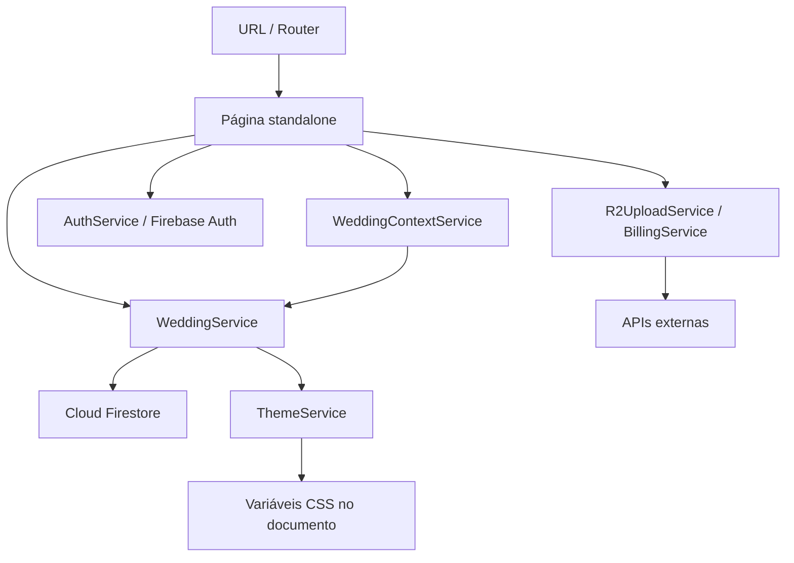

# Arquitetura da aplicação

[Índice geral](../../README.md)

## Inicialização

`src/main.ts` inicializa `App` com `appConfig`. A configuração registra Router, HttpClient, Firebase App, Authentication, Firestore, service worker e `GlobalErrorHandler`.

`App` hospeda o outlet de rotas e o outlet global de toasts. Inicializa o tema e acompanha navegação e a primeira resposta de autenticação para controlar carregamento. O tratamento global recarrega a página quando reconhece a mensagem `Loading chunk ... failed`; outros erros vão ao console.

## Organização e estado

| Área | Responsabilidade |
| --- | --- |
| `core/models` | Interfaces do domínio |
| `core/services` | Persistência, contexto, autenticação, cobrança, upload e tema |
| `core/guards` | Entrada no login, painel, premium e demo |
| `core/constants` | Presets de cores e opções de fontes |
| `core/utils` | Conversão de URLs de imagem |
| `pages` | Estado de formulário, composição visual e ações de cada tela |
| `layout` | Links de navegação pública e administrativa |
| `shared/ui` | Componentes reutilizáveis e toasts |

Não há store global separado. O contexto usa `BehaviorSubject`; as telas combinam Observables, `AsyncPipe`, propriedades e alguns signals. Assinaturas de várias telas usam `takeUntilDestroyed`. Dados Firestore são observados por `docData` e `collectionData`; a descoberta de casamentos do proprietário usa leitura pontual.

## Rotas e contexto

As rotas estão em [app.routes.ts](app.routes.ts), com importação dinâmica de componentes. As páginas públicas usam `:slug` como ID do documento do casamento, sem consulta a uma coleção separada de slugs.

`WeddingContextService` guarda o casamento administrativo em `localStorage`, chave `sim.activeWeddingId`, e publica `activeWeddingId$`. A normalização remove acentos, converte para minúsculas e usa hífens; o fallback é `default`. Essa escolha local não comprova propriedade.

Rotas globais públicas sem slug usam `default`. O guard de demo também grava `default` no contexto, podendo substituir a seleção administrativa anterior. Os aliases `/default/admin` e `/default/admin/:section` redirecionam para `/demo`.

Veja os catálogos completos das áreas [pública](pages/public/README.md) e [administrativa](pages/admin/README.md).

## Estilos, imagens e PWA

[ThemeService](core/services/theme.service.ts) acompanha URL e casamento ativo, lê o tema e aplica tokens `--color-*` no elemento raiz. A fonte script do casamento é aplicada nas rotas públicas de casamento; as demais usam a fonte padrão. Os estilos globais estão em `src/styles.css`; páginas mantêm CSS próprio.

O service worker é ativado em produção ou por `serviceWorkerEnabled`, com registro quando a aplicação estabiliza ou após 30 segundos. O cache cobre arquivos da aplicação e assets. Isso não representa garantia de funcionamento offline de Firestore, autenticação, upload ou pagamentos.

A aplicação usa diretamente `window`, `document`, `localStorage` e APIs do navegador. Não há SSR configurado. Confira [assets](../../public/README.md) e [operação](../../docs/operacao/README.md).
